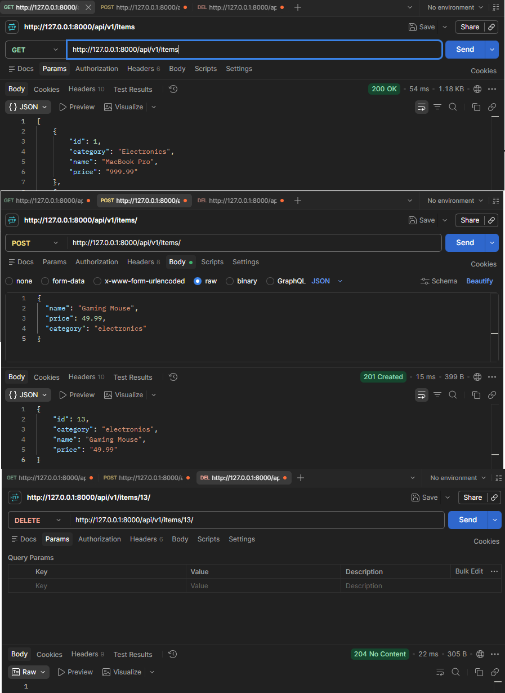

# E-Commerce REST API

A backend E-Commerce REST API built with **Django, Django REST Framework, and PostgreSQL**.

The API provides user authentication, product browsing, category filtering, and shopping cart management through RESTful endpoints. Authenticated users can manage their own shopping cart while token authentication protects user-specific functionality.

This project was originally developed as a **Django REST Framework assessment** and demonstrates my understanding of backend API development, database relationships, authentication, HTTP methods, and automated testing.

## Features

- User signup
- User login and logout
- Token-based authentication
- Retrieve authenticated user information
- View all store items
- View individual items
- Filter items by category
- Add items to a shopping cart
- View cart contents
- Calculate cart totals
- Increase and decrease item quantities
- Automatically remove cart items when quantity reaches zero
- Remove items from the cart
- Store application data with PostgreSQL
- Run the application with Docker
- Validate API behavior with automated Django tests

## Preview



## Tech Stack

- **Python**
- **Django**
- **Django REST Framework**
- **PostgreSQL**
- **DRF Token Authentication**
- **Docker**
- **REST APIs**
- **Django Test Framework**

## What I Built

I implemented the backend API functionality required by the assessment using Django and Django REST Framework.

My work included:

- Creating Django models and database relationships
- Building REST API endpoints with Django REST Framework
- Implementing user signup, login, and logout
- Generating and managing authentication tokens
- Protecting user-specific endpoints with authentication
- Retrieving authenticated user information
- Building endpoints for retrieving store items
- Filtering items by category
- Creating shopping cart functionality
- Adding items to an authenticated user's cart
- Increasing and decreasing cart quantities
- Removing items from the cart
- Calculating cart totals
- Connecting the Django application to PostgreSQL
- Running the application and database with Docker
- Using automated tests to verify API behavior

## API Endpoints

### Authentication

| Method | Endpoint                | Description                                         |
| ------ | ----------------------- | --------------------------------------------------- |
| `POST` | `/api/v1/users/signup/` | Create a new client, cart, and authentication token |
| `POST` | `/api/v1/users/login/`  | Log in and retrieve/create an authentication token  |
| `POST` | `/api/v1/users/logout/` | Log out and delete the authentication token         |
| `GET`  | `/api/v1/users/info/`   | Retrieve authenticated client information           |

### Items

| Method | Endpoint                             | Description                                  |
| ------ | ------------------------------------ | -------------------------------------------- |
| `GET`  | `/api/v1/items/`                     | Retrieve all store items                     |
| `GET`  | `/api/v1/items/<item_id>/`           | Retrieve an individual item                  |
| `POST` | `/api/v1/items/<item_id>/`           | Add an item to the authenticated user's cart |
| `GET`  | `/api/v1/items/category/<category>/` | Filter items by category                     |

### Cart

| Method      | Endpoint                                                 | Description                             |
| ----------- | -------------------------------------------------------- | --------------------------------------- |
| `GET`       | `/api/v1/cart/`                                          | Retrieve cart items and total price     |
| `PUT/PATCH` | `/api/v1/cart/method/<method>/cart_item/<cart_item_id>/` | Increase or decrease an item's quantity |
| `DELETE`    | `/api/v1/cart/<cart_item_id>/`                           | Remove an item from the cart            |

The quantity endpoint accepts:

```text
add
sub
```

to increase or decrease the quantity of a cart item.

## Authentication

The API uses **Django REST Framework Token Authentication**.

After a successful signup or login, the client receives an authentication token. Protected endpoints use that token to identify the authenticated user and ensure that user-specific resources, such as shopping carts, are accessed by the correct client.

Authenticated requests use:

```text
Authorization: Token <token>
```

Logging out deletes the user's current authentication token.

## Shopping Cart

Each authenticated client has their own shopping cart.

The API supports:

- Adding products
- Viewing cart contents
- Increasing quantities
- Decreasing quantities
- Removing individual cart items
- Automatically removing an item when its quantity reaches zero
- Calculating the total price of the cart

Cart operations are tied to the authenticated user rather than requiring the client to manually provide ownership information.

## Database

The application uses **PostgreSQL** for persistent data storage.

Django's ORM is used to interact with the database through Python models rather than writing raw SQL for normal application operations.

The database stores application data including users, store items, carts, and cart items.

## Docker

The project uses Docker to provide a consistent development environment for the Django application and PostgreSQL database.

The application can be started using Docker Compose:

```bash
docker compose up --build
```

This starts the required application services and allows Django to communicate with PostgreSQL through the Docker network.

## Testing

The project uses Django's automated testing tools to verify API functionality.

The assessment included automated tests designed to validate the required API behavior.

Tests cover functionality such as:

- User creation and authentication
- Authentication tokens
- Item retrieval
- Category filtering
- Shopping cart operations
- Cart quantity changes
- Cart item removal
- API response behavior

The complete Django test suite can be run with:

```bash
python manage.py test
```

When running the application through Docker, tests can also be executed inside the Django container.

Automated testing helped verify that API endpoints returned the expected responses and that database changes occurred correctly after requests.

## What I Learned

This project strengthened my understanding of building backend applications with Django and Django REST Framework.

It gave me hands-on experience with:

- Designing RESTful API endpoints
- Working with Django models and the ORM
- Creating relationships between database models
- Implementing token-based authentication
- Protecting endpoints based on authentication
- Working with HTTP methods and status codes
- Managing user-specific resources
- Connecting Django to PostgreSQL
- Testing API behavior and database changes
- Running application services with Docker

The project also helped me better understand the complete request-response flow of a backend API, from an incoming HTTP request through authentication, view logic, database operations, and the final HTTP response.

## Project Background

This application was originally completed as part of a **Django REST Framework assessment**.

The assessment provided the project requirements and automated tests used to evaluate the required API behavior. I implemented the Django models, views, authentication, database interactions, and API functionality needed to satisfy those requirements.

I have kept the project in my portfolio because it demonstrates my progression from foundational Python and Object-Oriented Programming into backend development with Django, REST APIs, PostgreSQL, authentication, testing, and Docker.
